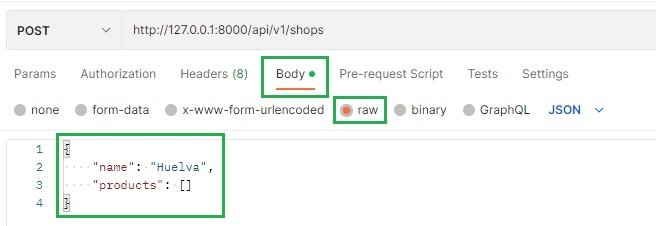
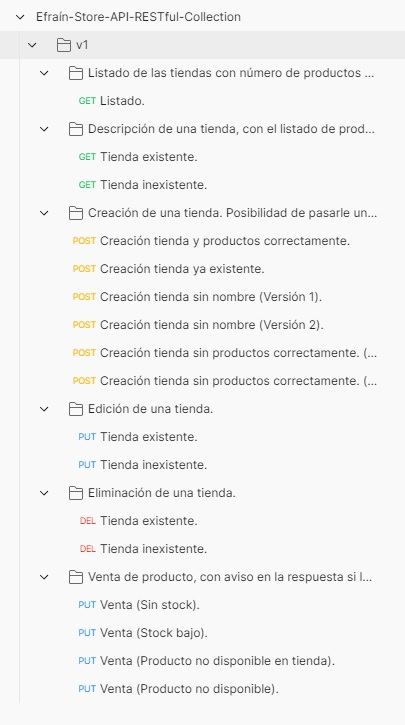

# Efraín Store API RESTful

## Info

The Laravel project together with its DB are deployed in docker, the necessary docker-compose.yml file is included in the project.

## Requirements

- Docker

## Init

1º Build docker and start php laravel proyect.

(By first locating ourselves in the directory where the file docker-compose.yml is located) Keep terminal open to keep the project up and running.
```bash
docker-compose up
```

2º Run to execute Migrations
```bash
docker exec -it purple-hexagon_store-API-RESTful_php php artisan migrate
```

3º Run to execute Seeders
```bash
docker exec -it purple-hexagon_store-API-RESTful_php php artisan db:seed
```

## Util

Reset database
```bash
docker exec -it purple-hexagon_store-API-RESTful_php php artisan migrate:fresh --seed
```

## Start

Start php laravel proyect (If it was stopped).
```bash
docker exec -it purple-hexagon_store-API-RESTful_php php artisan serve
```

## Docker containers

1º Access mariadb container.
```bash
docker exec -it purple-hexagon_store-API-RESTful_mariadb bash
```

2º Access php laravel container.
```bash
docker exec -it purple-hexagon_store-API-RESTful_php bash
```

### API endpoints

- Listado de las tiendas con número de productos de cada una.
  
  GET http://127.0.0.1:8000/api/v1/shops


- Descripción de una tienda, con el listado de productos de la misma y
  cantidad.

  GET http://127.0.0.1:8000/api/v1/shops/{shopId}


- Creación de una tienda. Posibilidad de pasarle una colección o array de
  productos para almacenarlos en base de datos.

  POST http://127.0.0.1:8000/api/v1/shops

  
- Edición de una tienda.

  PUT http://127.0.0.1:8000/api/v1/shops/{shopId}


- Eliminación de una tienda.

  DELETE http://127.0.0.1:8000/api/v1/shops/{shopId}


- Venta de producto, con aviso en la respuesta si la tienda está a
  punto de quedarse sin stock, o si la operación es imposible por falta de stock.

  PUT http://127.0.0.1:8000/api/v1/products/buy/{shopId}

## API testing with Postman

Import Postman Collections for API endpoint testing from the following file:

[Efraín-Store-API-RESTful-Collection.postman_collection.json](postman/Efraín-Store-API-RESTful-Collection.postman_collection.json)

The parameters passed in Postman requests are in Json format in: Body > raw.



The Postman API requests are prepared to be executed in order from the first to the last, otherwise they could change records needed for another request.



## License
[MIT](https://choosealicense.com/licenses/mit/)